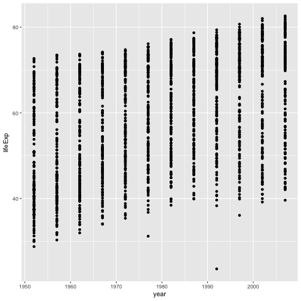
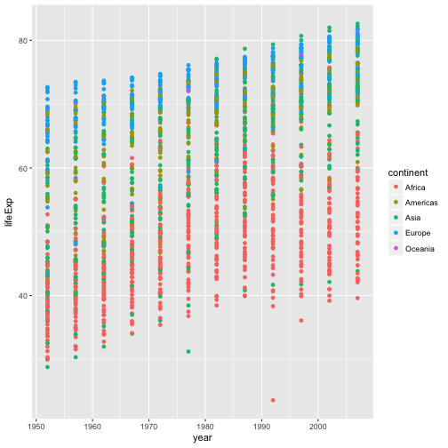
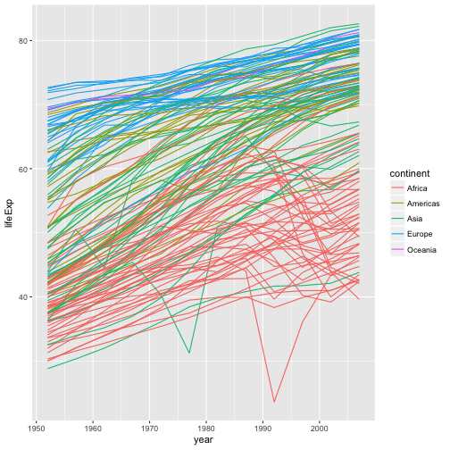
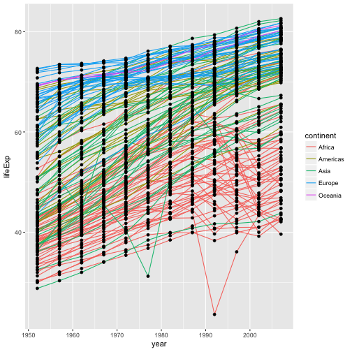

Plotting our data is one of the best ways to
quickly explore it and the various relationships
between variables.

There are three main plotting systems in R,
the [base plotting system][base], the [lattice][lattice]
package, and the [ggplot2][ggplot2] package.

[base]: http://www.statmethods.net/graphs/
[lattice]: http://www.statmethods.net/advgraphs/trellis.html
[ggplot2]: http://www.statmethods.net/advgraphs/ggplot2.html

Today we'll be learning about the ggplot2 package, because
it is the most effective for creating publication quality
graphics.

ggplot2 is built on the grammar of graphics, the idea that any plot can be
expressed from the same set of components: a **data** set, a
**coordinate system**, and a set of **geoms**--the visual representation of data
points.

The key to understanding ggplot2 is thinking about a figure in layers.
This idea may be familiar to you if you have used image editing programs like Photoshop, Illustrator, or
Inkscape.

Let's start off with an example:

~~~
library("ggplot2")
ggplot(data = gapminder, aes(x = gdpPercap, y = lifeExp)) +
  geom_point()
~~~
{: .language-r}

So the first thing we do is call the `ggplot` function. This function lets R
know that we're creating a new plot, and any of the arguments we give the
`ggplot` function are the *global* options for the plot: they apply to all
layers on the plot.

We've passed in two arguments to `ggplot`. First, we tell `ggplot` what data we
want to show on our figure, in this example the gapminder data we read in
earlier. For the second argument we passed in the `aes` function, which
tells `ggplot` how variables in the **data** map to *aesthetic* properties of
the figure, in this case the **x** and **y** locations. Here we told `ggplot` we
want to plot the "gdpPercap" column of the gapminder data frame on the x-axis, and
the "lifeExp" column on the y-axis. Notice that we didn't need to explicitly
pass `aes` these columns (e.g. `x = gapminder[, "gdpPercap"]`), this is because
`ggplot` is smart enough to know to look in the **data** for that column!

By itself, the call to `ggplot` isn't enough to draw a figure:

~~~
ggplot(data = gapminder, aes(x = gdpPercap, y = lifeExp))
~~~
{: .language-r}

We need to tell `ggplot` how we want to visually represent the data, which we
do by adding a new **geom** layer. In our example, we used `geom_point`, which
tells `ggplot` we want to visually represent the relationship between **x** and
**y** as a scatterplot of points:

~~~
ggplot(data = gapminder, aes(x = gdpPercap, y = lifeExp)) +
  geom_point()
~~~
{: .language-r}

> ## Challenge 1
>
> Modify the example so that the figure shows how life expectancy has
> changed over time:
>
> 
> ~~~
> ggplot(data = gapminder, aes(x = gdpPercap, y = lifeExp)) + geom_point()
> ~~~
> {: .language-r}
>
> Hint: the gapminder dataset has a column called "year", which should appear
> on the x-axis.
>
> > ## Solution to challenge 1
> >
> > Here is one possible solution:
> >
> > 
> > ~~~
> > ggplot(data = gapminder, aes(x = year, y = lifeExp)) + geom_point()
> > ~~~
> > {: .language-r}
> > 
> > 
> >
> {: .solution}
{: .challenge}

>
> ## Challenge 2
>
> In the previous examples and challenge we've used the `aes` function to tell
> the scatterplot **geom** about the **x** and **y** locations of each point.
> Another *aesthetic* property we can modify is the point *color*. Modify the
> code from the previous challenge to **color** the points by the "continent"
> column. What trends do you see in the data? Are they what you expected?
>
> > ## Solution to challenge 2
> >
> > In the previous examples and challenge we've used the `aes` function to tell
> > the scatterplot **geom** about the **x** and **y** locations of each point.
> > Another *aesthetic* property we can modify is the point *color*. Modify the
> > code from the previous challenge to **color** the points by the "continent"
> > column. What trends do you see in the data? Are they what you expected?
> >
> > 
> > ~~~
> > ggplot(data = gapminder, aes(x = year, y = lifeExp, color=continent)) +
> >   geom_point()
> > ~~~
> > {: .language-r}
> > 
> > 
> >
> {: .solution}
{: .challenge}

## Layers

Using a scatterplot probably isn't the best for visualizing change over time.
Instead, let's tell `ggplot` to visualize the data as a line plot:

~~~
ggplot(data = gapminder, aes(x=year, y=lifeExp, by=country, color=continent)) +
  geom_line()
~~~
{: .language-r}

Instead of adding a `geom_point` layer, we've added a `geom_line` layer. We've
added the **by** *aesthetic*, which tells `ggplot` to draw a line for each
country.

But what if we want to visualize both lines and points on the plot? We can
simply add another layer to the plot:

~~~
ggplot(data = gapminder, aes(x=year, y=lifeExp, by=country, color=continent)) +
  geom_line() + geom_point()
~~~
{: .language-r}

It's important to note that each layer is drawn on top of the previous layer. In
this example, the points have been drawn *on top of* the lines. Here's a
demonstration:

~~~
ggplot(data = gapminder, aes(x=year, y=lifeExp, by=country)) +
  geom_line(aes(color=continent)) + geom_point()
~~~
{: .language-r}

In this example, the *aesthetic* mapping of **color** has been moved from the
global plot options in `ggplot` to the `geom_line` layer so it no longer applies
to the points. Now we can clearly see that the points are drawn on top of the
lines.

> ## Tip: Setting an aesthetic to a value instead of a mapping
>
> So far, we've seen how to use an aesthetic (such as **color**) as a *mapping* to a variable in the data. For example, when we use `geom_line(aes(color=continent))`, ggplot will give a different color to each continent. But what if we want to change the colour of all lines to blue? You may think that `geom_line(aes(color="blue"))` should work, but it doesn't. Since we don't want to create a mapping to a specific variable, we simply move the color specification outside of the `aes()` function, like this: `geom_line(color="blue")`.
{: .callout}

> ## Challenge 3
>
> Switch the order of the point and line layers from the previous example. What
> happened?
>
> > ## Solution to challenge 3
> >
> > Switch the order of the point and line layers from the previous example. What
> > happened?
> >
> > 
> > ~~~
> > ggplot(data = gapminder, aes(x=year, y=lifeExp, by=country)) +
> >  geom_point() + geom_line(aes(color=continent))
> > ~~~
> > {: .language-r}
> > 
> > 
> >
> > The lines now get drawn over the points!
> >
> {: .solution}
{: .challenge}
