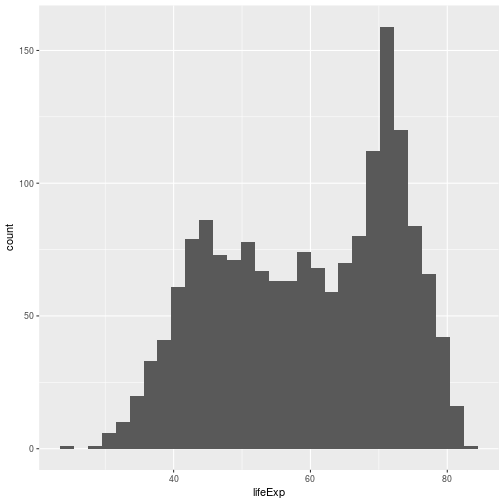
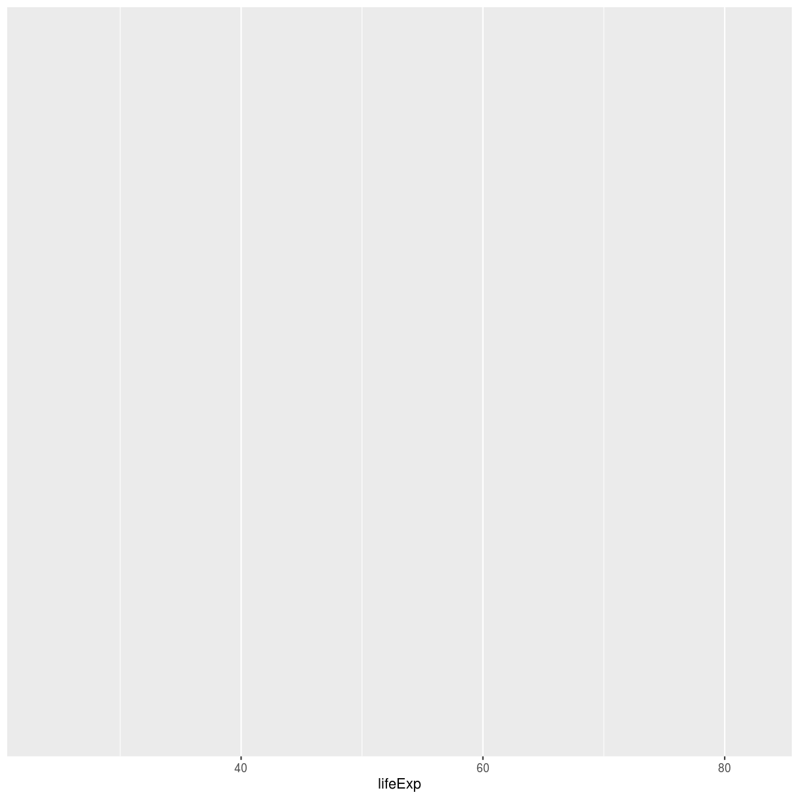
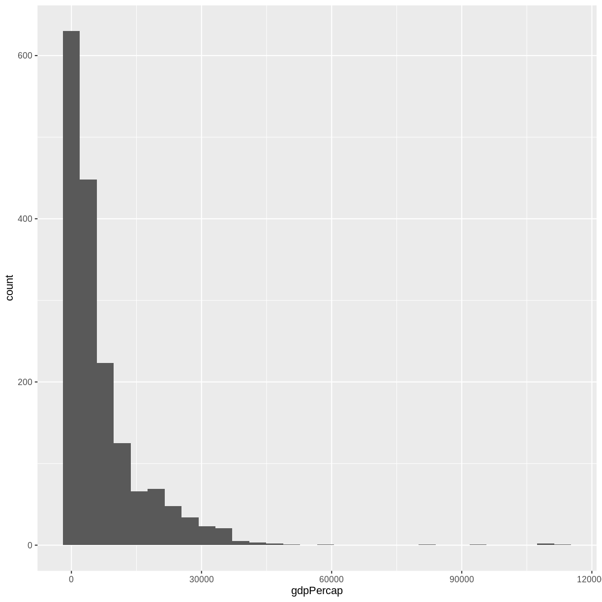
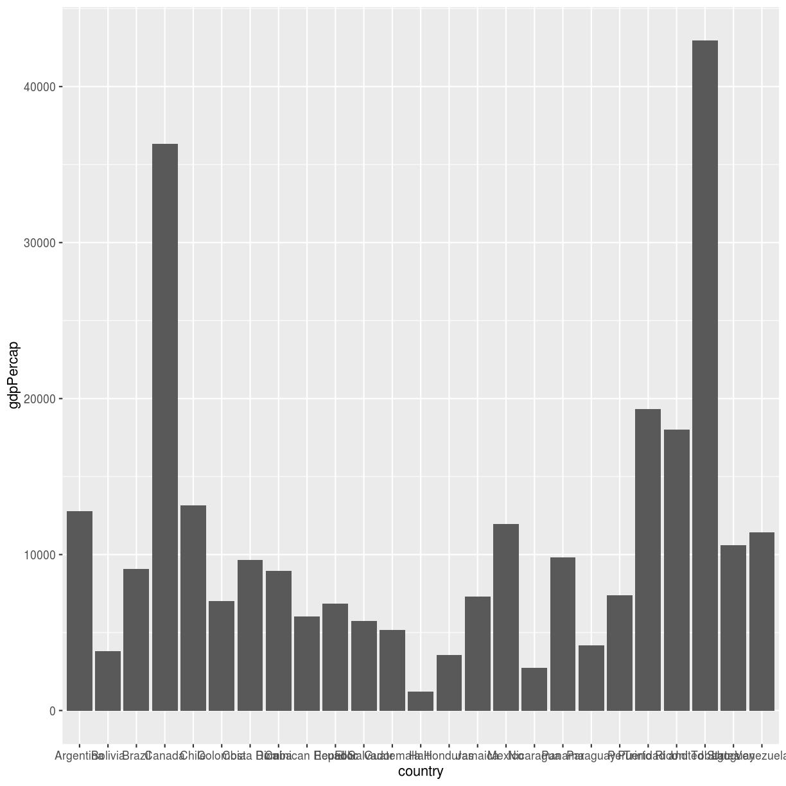
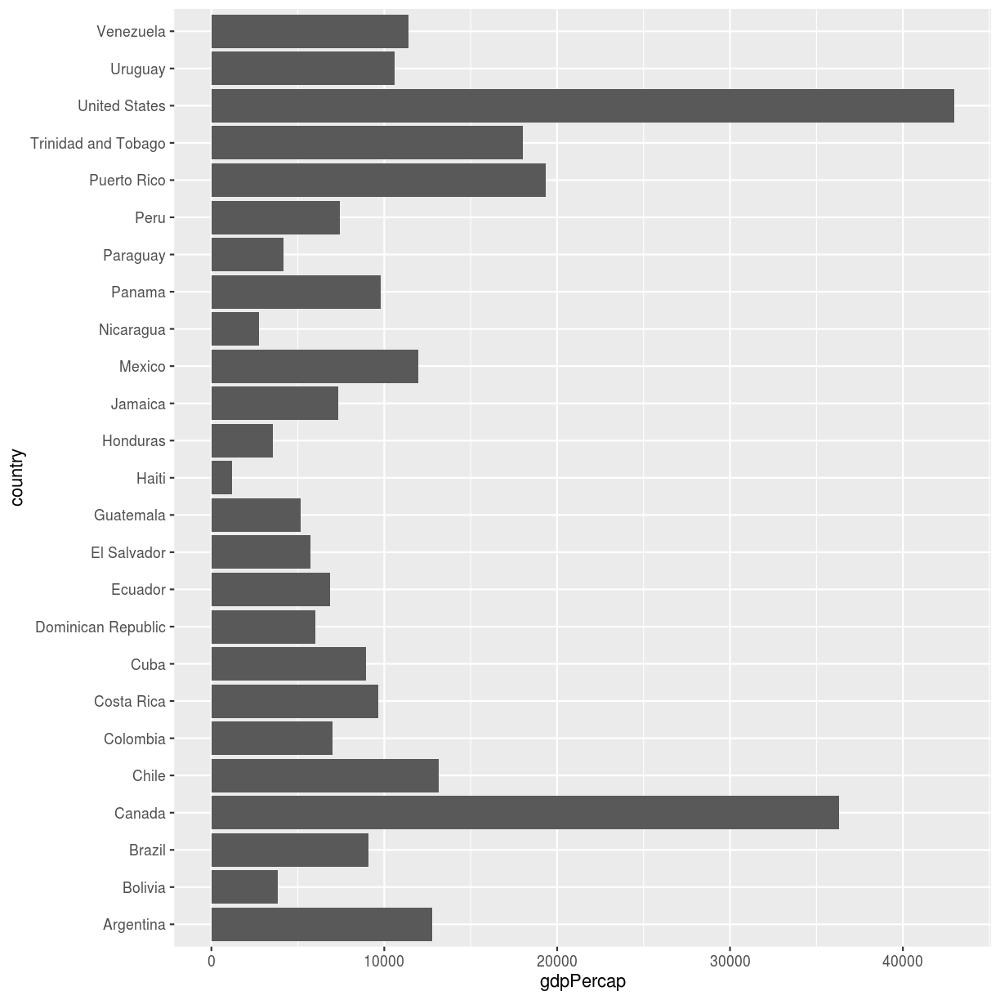
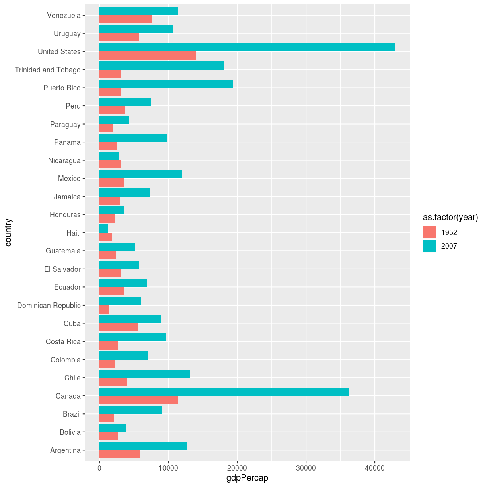

---
# Please do not edit this file directly; it is auto generated.
# Instead, please edit 07-plot-ggplot2.md in _episodes_rmd/
title: Introduction to Visualization
teaching: 20
exercises: 15
questions:
- "What are the basics of creating graphics in R?"
objectives:
- "To be able to use ggplot2 to generate histograms and bar plots."
- "To apply geometry and aesthetic layers to a ggplot plot."
- "To manipulate the aesthetics of a plot using different colors and position parameters."
keypoints:
- "Use `ggplot2` to create plots."
- "Think about graphics in layers: aesthetics, geometry, etc."
source: Rmd
---

Plotting our data is one of the best ways to quickly explore it and the various
relationships between variables. There are three main plotting systems in R, the
[base plotting system](http://www.statmethods.net/graphs/), the
[lattice](http://www.statmethods.net/advgraphs/trellis.html) package, and the
[ggplot2](http://www.statmethods.net/advgraphs/ggplot2.html) package. Today and
tomorrow we'll be learning about the ggplot2 package, because it is the most
effective for creating publication quality graphics. In this episode, we will
introduce the key features of a ggplot and make a few example plots. We will
expand on these concepts and see how they apply to geospatial data types when we
start working with geospatial data in the [R for Raster and Vector
Data](https://datacarpentry.org/r-raster-vector-geospatial/) lesson.

ggplot2 is built on the grammar of graphics, the idea that any plot can be
expressed from the same set of components: a **data** set, a **coordinate
system**, and a set of **geoms**--the visual representation of data points. The
key to understanding ggplot2 is thinking about a figure in layers. This idea may
be familiar to you if you have used image editing programs like Photoshop,
Illustrator, or Inkscape. In this episode we will focus on two geoms
- histograms and bar plot. In the [R for Raster and Vector Data](https://datacarpentry.org/r-raster-vector-geospatial/) lesson we will work with a number of other geometries
and learn how to customize our plots.

Let's start off with an example plotting the
distribution of life expectancy in our dataset. The first thing we do is call the `ggplot` function. This function lets R
know that we're creating a new plot, and any of the arguments we give the
`ggplot()` function are the global options for the plot: they apply to all
layers on the plot.

We will pass in two arguments to `ggplot`. First, we tell
`ggplot` what data we
want to show on our figure, in this example we use the gapminder data we read in
earlier. For the second argument we pass in the `aes()` function, which
tells `ggplot` how variables in the data map to aesthetic properties of
the figure. Here we will tell `ggplot` we
want to plot the "lifeExp" column of the gapminder data frame on the x-axis. We don't need to specify a y-axis
for histograms.

~~~
library("ggplot2")
ggplot(data = gapminder, aes(x = lifeExp)) +   
  geom_histogram()
~~~
{: .language-r}

By itself, the call to `ggplot` isn't enough to draw a figure:

~~~
ggplot(data = gapminder, aes(x = lifeExp))
~~~
{: .language-r}

We need to tell `ggplot` how we want to visually represent the data, which we
do by adding a geom layer. In our example, we used `geom_histogram()`, which
tells `ggplot` we want to visually represent the
distribution of one variable (in our case "lifeExp"):

~~~
ggplot(data = gapminder, aes(x = lifeExp)) +   
  geom_histogram()
~~~
{: .language-r}

~~~
`stat_bin()` using `bins = 30`. Pick better value with `binwidth`.
~~~
{: .output}

> ## Challenge 1
>
> Modify the example so that the figure shows the 
> distribution of gdp per capita, rather than life 
> expectancy:
>
> > ## Solution to challenge 1
> >
> > 
> > ~~~
> > ggplot(data = gapminder, aes(x = gdpPercap)) +   
> >   geom_histogram()
> > ~~~
> > {: .language-r}
> > 
> > 
> > 
> > ~~~
> > `stat_bin()` using `bins = 30`. Pick better value with `binwidth`.
> > ~~~
> > {: .output}
> > 
> > 
> {: .solution}
{: .challenge}

The histogram is a useful tool for visualizing the 
distribution of a single categorical variable. What if
we want to compare the gdp per capita of the countries in 
our dataset? We can use a bar (or column) plot. 
To simplify our plot, let's look at data only from the most 
recent year and only
from countries in the Americas.

~~~
gapminder_small <- filter(gapminder, year == 2007, continent == "Americas")
~~~
{: .language-r}

This time, we will use the `geom_col()` function as our geometry. 
We will plot countries on the x-axis (listed in alphabetic order
by default) and gdp per capita on the y-axis.

~~~
ggplot(data = gapminder_small, aes(x = country, y = gdpPercap)) + 
  geom_col()
~~~
{: .language-r}

With this many bars plotted, it's impossible to read all of the 
x-axis labels. A quick fix to this is the add the `coord_flip()` 
function to the end of our plot code.

~~~
ggplot(data = gapminder_small, aes(x = country, y = gdpPercap)) + 
  geom_col() +
  coord_flip()
~~~
{: .language-r}

There are more sophisticated ways of modifying axis
labels. We will be learning some of those methods
later in this workshop.

> ## Challenge 2
>
> In the previous examples and challenge we've used the `aes` function to tell
> the `geom_histogram()` and `geom_col()` functions which columns 
> of the 
> data set to plot.
> Another aesthetic property we can modify is the
> color. Create a new bar (column) plot showing the gdp per capita
> of all countries in the Americas for the years 1952 and 2007, 
> color coded by year.
>
> > ## Solution to challenge 2
> >
> > First we create a new object with 
> > our filtered data: 
> > 
> > 
> > ~~~
> > gapminder_small_2 <- gapminder %>%
> >                         filter(continent == "Americas",
> >                                year %in% c(1952, 2007))
> > ~~~
> > {: .language-r}
> > 
> > Then we plot that data using the `geom_col()`
> > geom function. We color bars using the `fill`
> > parameter within the `aes()` function. 
> > Since there are multiple bars for each 
> > country, we use the `position` parameter
> > to "dodge" them so they appear side-by-side. 
> > The default behavior for `postion` in `geom_col()`
> > is "stack".
> > 
> > 
> > ~~~
> > ggplot(gapminder_small_2, 
> >        aes(x = country, y = gdpPercap, 
> >        fill = as.factor(year))) +
> >    geom_col(position = "dodge") + 
> >    coord_flip()
> > ~~~
> > {: .language-r}
> > 
> > 
> >
> {: .solution}
{: .challenge}

The examples given here are just the start of 
creating complex and beautiful graphics with R. 
In [a later lesson](https://datacarpentry.org/r-raster-vector-geospatial/) we will go into much 
more depth, including: 
- plotting geospatial specific data types
- adjusting the color scheme of our plots
- setting and formatting plot titles, subtitles, and axis labels
- creating multi-panel plots
- creating point (scatter) and line plots
- layering datasets to create multi-layered plots
- creating and customizing a plot legend
- and much more!

The examples we've worked through in this episode should give you the building
blocks for working with the more complex graphic types and customizations we
will be working with in that lesson.
